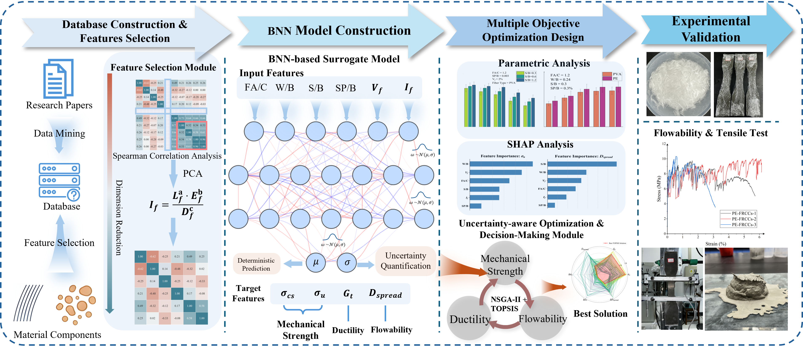

# Bayesian neural networks for uncertainty-aware FRCC prediction and multi-objective design



## Research overview

Fiber-reinforced cementitious composites (FRCCs) offer a combination of strength, tensile ductility, and workability that is attractive for advanced cement-based materials. Their performance depends on interacting mixture variables, fiber type, and fiber volume fraction, so a mix that performs well in one property may introduce uncertainty or compromise another. A point prediction alone is therefore insufficient for selecting a practical mixture.

This study develops an uncertainty-aware Bayesian neural network (BNN) framework for FRCC property prediction and material design. An experimental database is used to learn the relationships between mixture descriptors and four outputs:

- compressive strength, `CX (MPa)`;
- ultimate tensile strength, `UTX (MPa)`;
- tensile strain-energy density, `G (kJ/m³)`;
- slump-flow diameter, `MiniSF (cm)`.

The framework combines three stages. First, BNNs learn probabilistic predictions rather than only a single estimated value. The predictive uncertainty is separated into data-dependent and model-related components, allowing the analysis to distinguish noisy observations from regions where the model has limited knowledge. MC-Dropout BNNs are used as the main uncertainty-aware models, while BBB-BNNs, random forests, and Gaussian processes provide comparison baselines.

Second, the learned relationships are interpreted through correlation analysis, sensitivity analysis, fiber-effect analysis, and SHAP-based feature importance. These analyses connect the model outputs to mixture variables such as sand-to-cement ratio, fly-ash-to-cement ratio, water-to-binder ratio, superplasticizer-to-binder ratio, fiber volume fraction, and fiber type.

Third, the probabilistic predictions are passed to a multi-objective design workflow. NSGA-II searches for Pareto-optimal mixtures that balance the target properties and predictive uncertainty for PE-FRCCs and PVA-FRCCs. TOPSIS then ranks practical compromise solutions under different performance–uncertainty preferences. The resulting workflow connects prediction, uncertainty assessment, interpretation, and mixture selection in one reproducible pipeline.

The main purpose of the repository is to make this complete workflow inspectable and reproducible: from the curated database and trained checkpoints to the uncertainty analysis, Pareto fronts, preference sensitivity, and manuscript figures.

## Repository contents

```text
data/                   Curated database, predictions, Pareto sets, and rankings
models/                 Selected BBB and MC-Dropout checkpoints and scalers
training/               Original training, validation, and seed-search programs
optimization/           NSGA-II and TOPSIS optimization program
manuscript_figures/     Final-numbered manuscript figure renderers
revision_analysis/      Robustness and TOPSIS-weight sensitivity analyses
notebooks/              Historical exploratory analysis notebooks
assets/                 Graphical abstract
docs/                   Figure audit and provenance notes
tests/                  Data, model, and output integrity tests
reproduce_all.py        One-command manuscript figure reproduction
```

## Reproducing the analysis

Python 3.10 or newer is recommended.

```bash
python -m venv .venv
```

On Windows, activate the environment with:

```bash
.venv\Scripts\activate
python -m pip install -r requirements.txt
```

Run the complete figure pipeline with:

```bash
python reproduce_all.py
```

For a fast installation and integrity check:

```bash
python reproduce_all.py --quick --dpi 150
python -m unittest discover -s tests -v
```

Generated figures are written to `figures/`. That directory is ignored by Git so that reproducing the manuscript does not create uncommitted changes.

## Manuscript figure map

The plotting pipeline follows the final manuscript figure numbering. Conceptual diagrams (Figures 1, 4, and 5) are not generated by code.

| Figure | Content | Reproduction source |
|---|---|---|
| 2 | Spearman matrices before and after dimensionality reduction | `figure_02_03_database.py` |
| 3 | Input and output parameter distributions | `figure_02_03_database.py` |
| 6–9 | BNN, random-forest, and Gaussian-process comparisons | `figure_06_09_model_comparison.py` |
| 10–13 | Prediction performance and data/model/total uncertainty | `figure_10_13_uncertainty.py` |
| 14 | FA/C sensitivity | `figure_14_fa_c.py` |
| 15 | W/B–S/B sensitivity | `figure_15_wb_sb.py` |
| 16 | Fiber type and volume-fraction effects | `figure_16_fiber_effects.py` |
| 17 | SHAP parameter importance | `figure_17_shap.py` |
| 18 | PE-FRCC Pareto projections and TOPSIS radar chart | `figure_18_topsis.py` |
| 19 | TOPSIS preference-weight sensitivity | `figure_19_topsis_sensitivity.py` |
| 20 | Experimental photographs and tensile stress–strain response | `figure_20_experimental.py` |

Figures 14 and 15 were formerly Figures 12 and 13 in some plotting filenames. Figures 18–20 also retain several historical filename conventions; the renderers and table above follow the final manuscript numbering. The detailed caption audit and data provenance are documented in [`docs/figure_audit.md`](docs/figure_audit.md).

## Data and model files

- `data/frcc_database.xlsx` is the modeling database used for feature analysis and training/validation reconstruction.
- `data/index_analysis_predictions.xlsx` contains saved predictive means and total standard deviations used to redraw Figures 14–16 after the original Origin projects were lost.
- `data/optimization/` contains the PE and PVA Pareto fronts and TOPSIS rankings.
- `data/topsis_sensitivity/` contains the revised decision-preference sensitivity analysis.
- `models/mc_dropout/` contains the selected MC-Dropout models for the four main targets.
- `models/bbb/` contains the selected BBB-BNN checkpoint used for the compressive-strength comparison.
- `models/scalers/` contains the feature and target scalers required by the saved checkpoints.

The selected manuscript checkpoints use MC-Dropout seeds 618, 424, 857, and 114 for the four targets, and BBB seed 857 for the compressive-strength comparison. The plotting pipeline uses deterministic train/test splits and explicit random seeds.

Figure 20(a–d) consists of empirical photographs and is included as source media. The raw acquisition/Origin project for Figure 20(e) was unavailable; `figure20e_digitized.csv` is transparently reconstructed from the archived raster by `digitize_figure_20e.py` and is derived display data rather than raw instrument data.

## Citation and contact

Please cite the associated article when using the database, models, analysis scripts, or figures. For questions about the database, checkpoints, or optimization workflow, open an issue in this repository.
